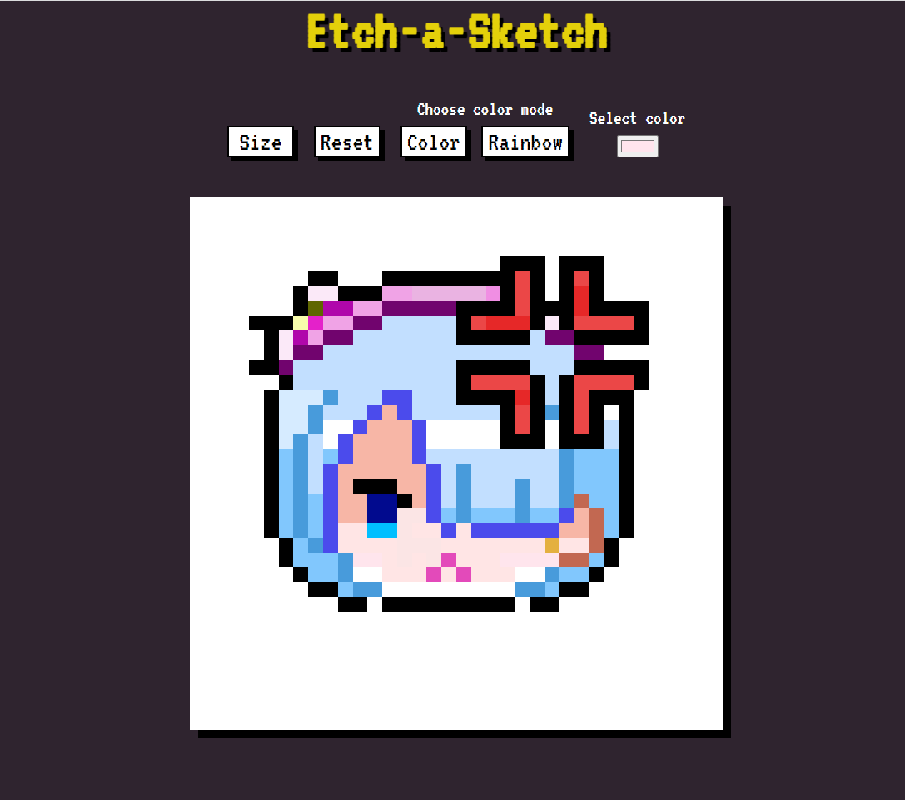

# Etch-A-Sketch

Create your own pixel art.  
[Live](https://alexign473.github.io/The-Odin-Project/03-etch-a-sketch/)

## Functionality

- Select any color for the pen.
- Rainbow pen colors each cell a random color.
- Create a grid size up to 100 x 100.

## Outcome of this project

- Practice of DOM and its manipulation
- CSS Grid understanding and usage.

