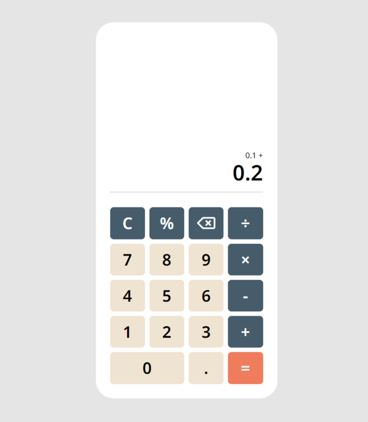

# Calculator

Simple calculator with basic math functions using vanilla JavaScript, HTML and CSS.  
[Live](https://isikava.github.io/The-Odin-Project-Foundations/04-calculator/)



## Outcome

- Great summary for The Odin Project Foundations Curriculum.
- Better knowledge of **Javascript**.
- CSS **Grid** understanding and usage.
- Learned how to add **keyboard support**.
- Learned about **event delegation**.

## Thoughts

The first interesting problem I encountered.
My calculate function accepts the operator callback function.
I get the operator from the user as a string. Turns out that you can't pass a callback function as a string xP.  
I found the solution in [this post](https://stackoverflow.com/a/912675).  
Dictionary of handlers.  
Put all of the action functions you might need into an object

```javascript
const actions = {
  '+': (a, b) => a + b,
  ...
};
```

and call them dictionary-style using the string.

```javascript
const res = calculate(firstNum, +inputValue, actions[operator]);
```

Of course I could just use switch, but this approach looks more elegant for me.
